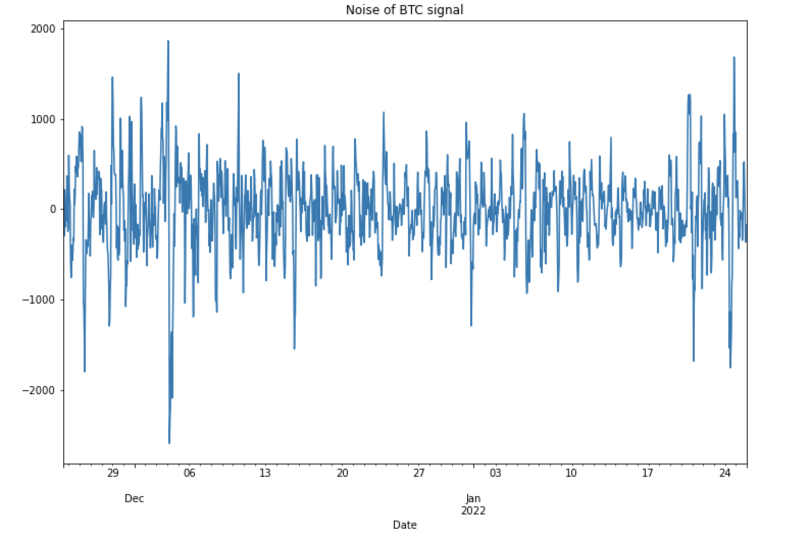
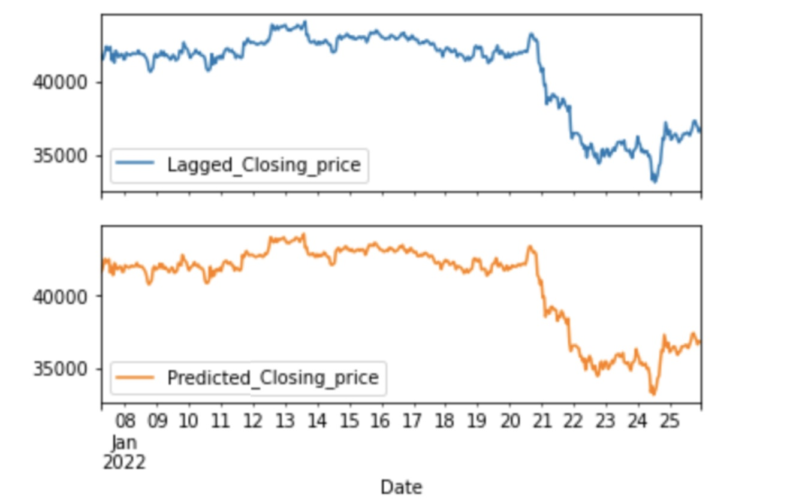
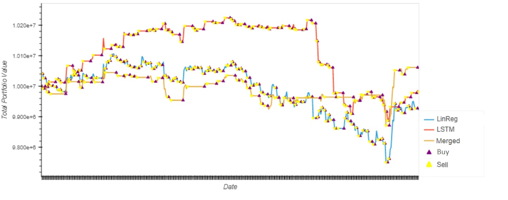

## Project Overview 

---

## Introduction
### Our Task 

We are a new team within an investment firm looking to enter the CryptoCurrency space with a algorithmic trading package for our clients. Due to limited resources management has tasked our team with building & testing a Time Series & Neutral Network model in order to predict future performance. Then evaluate our models and draw general conclusions based on our performance. 

For this Analysis we will need to answer: 
1. Identify commonly traded Crypto currencies with reliable data   
2. Create an Recurring Neural Network in order to gain a signal to trade on
3. Create a Regression Anlysis to in order to gain a signal to trade on
4. Merge signals from individual models to create a unique signal 
5. Backtest merged signal model to see how it performs in compairson to the indvidual models 

---

## Data Sources 
Data for this presentaion was found using:
1. BTC - https://api.kucoin.com/api/v1/market/candles?type={frequency}&symbol={ticker}-USDT&startAt={epoch}&endAt=0&limit=10000
---
## Data Analysis

### Part 1. Neural Network - LSTM Model 
Objective: Complete a LSTM model in order to make predictions that inform a signal 

Location: DeepLearing_LSTM.ipynb

1. Imports 

2. API Call to Kucoin Exchange 

3. Data Cleaning 

4. Data Preparation
    
    A. Prepare the training and testing data for the LSTM model.
   
    B. Use the window_data function to generate the X and y values for the model.
   
    C. Split the data into 70% training and 30% testingApply the MinMaxScaler to the X and y values
    
    D. Reshape the X_train and X_test data for the model.

5. Build and Train the LSTM RNN

    A. Define the model architecture

    B. Compile the model

    C.Fit the model to the training data

6. Summarize the model

7. Evaluate Model Performance

8. Making Predictions using closing prices

9. Create a signal based on predictions
----

### Part 2. Anlysis of Time Series Regression
Objective complete a regression analysis in order to gain a buy/sell signal 

Location: TimeSerie_LinearRegression.ipynb

Steps 
1. Inital Imports
2. API Call to Kucoin Exchange
3. Complete a Hodrick-Prescott Filter in order to filter out short-term fluctuations & decompose the time series into trend and non-trend componets 

4. Regression Analysis: Seasonal Effects with Sklearn Linear Regression
    
    A. Data Preparation
    
    B.Lagged Returns

    C.Train Test Split

    D.Linear Regression Model

5. Make predictions using the Testing Data

6. Out-of-Sample Performance

7. In-Sample Performance 

8. Create a Dataframe with Hours as the index & predicted returns 

    A. Calculate the differnce between prior hour and current hour predicted returns 

9. Create a signal based on the difference in hourly predicted returns where a difference greater than or equal to zero is a buy and less that zero is a sell

10. Signal is now completed

11. Note for implications: Additonal backtesting can be done by calulating: Entry/Exit, Position, Entry/Exit Position, Portfolio Holdings, Portfolio Cash, Portfolio Total,	Portfolio Daily Returns,Portfolio Cumulative Returns

----
## Part 3. Anlysis of Combined Porfolios
Objective: Merge signals from individual models to create a unique signal 

Location: PredictionsModels_n_Signal_BRK.ipynb

1. Imports 

2. Import Data from previous regression & RNN: In this case we are using the X_test as start data for our predictions. All data from API 

    A. Adapted X data for the different models 

    B. Output data y_test 

    C. Scale data for RNN

3. Load and predict LSTM model

4. Load and predict Linear Regression model

5. Merge signals from different models to an unique signal

    A. Strategy : -1 sell, 0 hold,  1 buy (on signals)

    B. Create column with difference (delta) of the cumulative signal. The first value of the delta column is hardcoded as 1 to provide the ability to buy if the signal advises this at time zero

    C. Create the buy/sell switch column and set to NaN as a placeholder for now.

    D. Create the "Action" column to document the FINAL OUTPUT action (i.e., buy, sell, or hold) that should be taken based on the signal. Initially set to NaN as placeholder for now.

6. Define function to determine what action to take while also minimizing the number of buys & sells (i.e., once a buy happens. another buy can only occur after a sell occurs).

    A. Create buy and sell switch components to compare to the Action Switch in each row

    B. Set a variable for the switch that can be updated after each run through the if statements to determine how the buy/sell switch should change. Initially set switch to 1 (i.e., buy) at time point zero because a buy must occur first after the start of the time series. Action Switch = 1 means "can buy", and Action Switch = 0 means "can sell" as defined above.

    C. Run through if statements based on the conditions to determine whether the action should be a buy (2), sell (0), or hold (1)

     * First look at the condition when a sell is possible according to the switch
    * Change the buy/sell switch to a "can buy" since a sell has now occurred

    * Second look at the condition when a buy is possible according to the switch

    * Change the buy/sell switch to a "can sell" since a buy has now occurred. action_switch = can_sell_switch

    * Finally look at the condition when a hold is needed due to no change in the signal from the previous time point
7. Test Final Signal

----
## Part 4. Backtesting 

Location: .ipynb

--- 

## Conclusions & Results 

Test Results

After merging the signals from the indiviual models we executed a model using an inital investment of $10,000,000 and a share size of 50. Here are our results:

Annualized return of 0.4% outperformed the indivual Time Serier Regression, LSTM models, and buy and hold position. 

Cummulative Returns of 0.5% outperformed the indivual Time Serier Regression, LSTM models, and buy and hold position. 

Annual Volatility of 1.67% resulted in the less volatility than the indivual Time Serier Regression, LSTM models, and buy and hold position. 

Sharpe ratio of .28 resulted in a greater return when compared to the risk free rate than the indivual Time Serier Regression, LSTM models, and buy and hold position. 

Sortino ratio of .44 resulted in a greater return when taking into account only the down side risk of our investment than the indivual Time Serier Regression and LSTM models. 

Overall after analysing the back testing results our recomendation is to not go to market with our model in its current state. Our results, while sufficent when compared to our indicual models, do not result in enough confidence/overal return to provide greater value to clients. 

---

## Implications 
In a real life scienero: 

* Explore the use of indicators to better refine our models. 
* Incorporating weights in the way we calculate our signals 
* Use different metrics for determining our signals
* Explored using less volitile assets such as stock or bonds. 
* Exploring was to automate how to change the amount sold in each transaction 
* Using a larger data set 
* Using days instead of Hours. Hours were used to filter out dip in 2020. 

* Potential Future State: Incorporating Indicators & Natural Language Processing 

