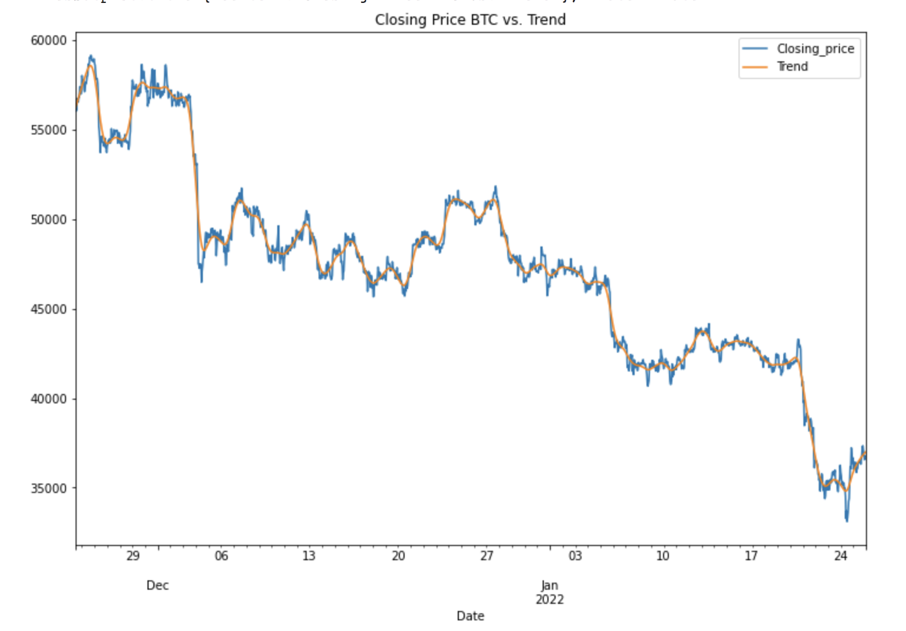

## Project Overview 

---

## Introduction
### Our Task 

We are a new team within an investment firm looking to enter the CryptoCurrency space with a passively managed algorithmic trading package that performs better than the S&P for our clients. Due to limited resources management has tasked our team with building & testing a Time Series & Neutral Network model in order to predict future performance. Then evaluate our models and draw general conclusions based on our performance. 

For this Analysis we will need to answer: 
1. Identify commonly traded Crypto currencies with reliable data   
2. Create an Recurring Neural Network in order to gain a signal to trade on
3. Create a Regression Anlysis to in order to gain a signal to trade on
4. Cominde the signals from step 2 & 3 in order to UPDATE

---

## Data Sources 
Data for this presentaion was found in three parts: 
1. ETH data sourced from https://api.kucoin.com/api/v1/market/candles?type={frequency}&symbol={ticker}-USDT&startAt={epoch}&endAt=0&limit=10000
---

## Data Analysis

### Part 1. Outcome of recurring Neural Network 
Location: .ipynb

### Part 2. Anlysis of Time Series Regression
Objective complete a regression analysis in order to gain a buy/sell signal to combine with the Neural Network Signal

Location: .ipynb

Steps 
1. Inital Imports
2. feed in Ethereum data as: 'Hour', 'Opening_price',  'Closing_price' , 'Highest_price' , 'Lowest_price' , 'Transaction_volume' ,  'Transaction_amount'
3. Complete a Hodrick-Prescott Filter in order to filter out short-term fluctuations & decompose the time series into trend and non-trend componets 

4. Regression Analysis: Seasonal Effects with Sklearn Linear Regression
    
    A. Data Preparation
    
    B.Lagged Returns

    C.Train Test Split

    D.Linear Regression Model

5. Make predictions using the Testing Data

6. Out-of-Sample Performance = "Out-of-Sample Root Mean Squared Error (RMSE): 1.08"

7. In-Sample Performance = "In-sample Root Mean Squared Error (RMSE): 0.82"

8. Create a Dataframe with Hours as the index & predicted returns 

    A. Calculate the differnce between prior hour and current hour predicted returns 

9. Create a signal based on the difference in hourly predicted returns where a difference greater than or equal to zero is a buy and less that zero is a sell

10. Signal is now completed

11. Note for implications: Additonal backtesting can be done by calulating: Entry/Exit, Position, Entry/Exit Position, Portfolio Holdings, Portfolio Cash, Portfolio Total,	Portfolio Daily Returns,Portfolio Cumulative Returns

## Part 3. Anlysis of Combined Porfolios
Location: .ipynb

## Part 4. Anlysis of PA Household Income Data
Location: .ipynb

--- 

## Conclusions & Results 
Based on our analysis our recomendations for 

Test Results

After combining 

---

## Implications 
In a real life scienero: 

